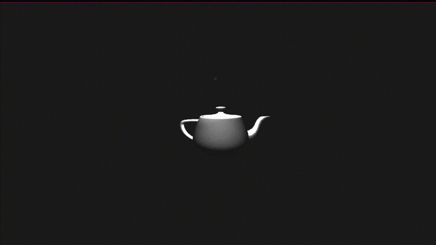
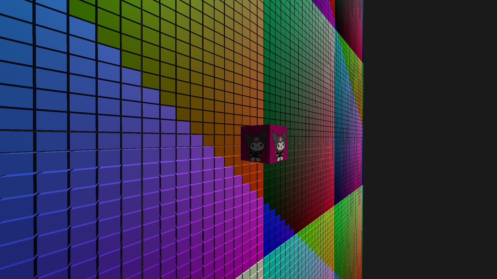
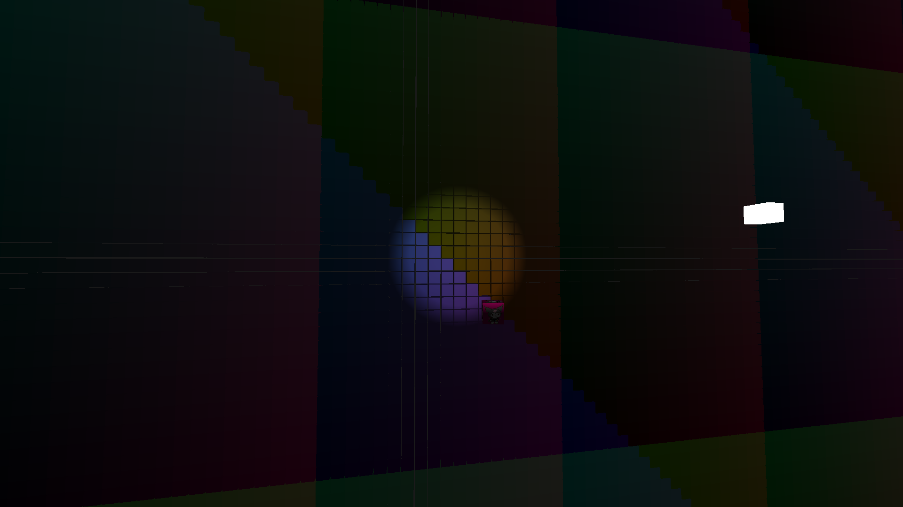
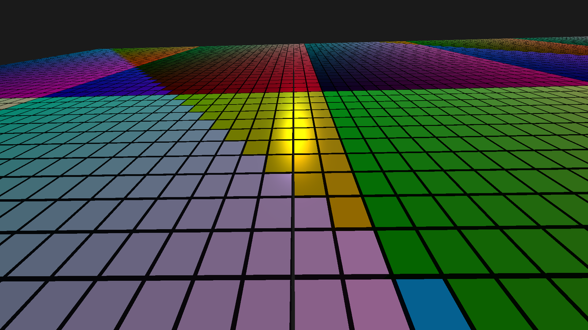
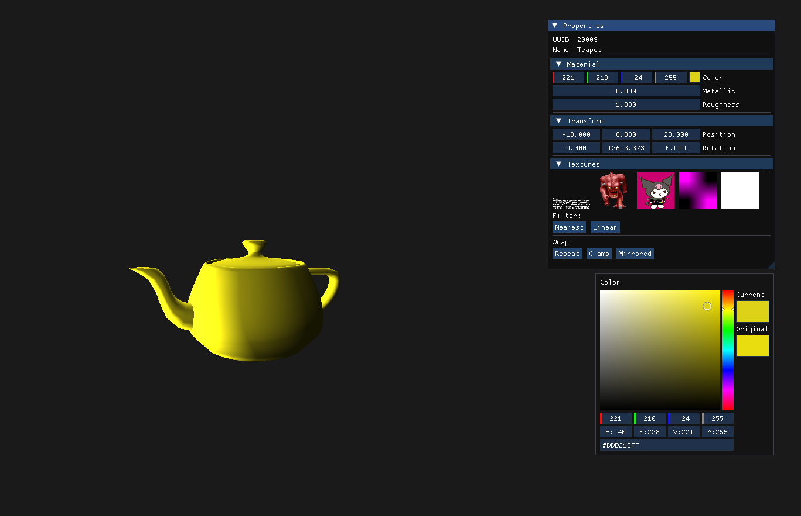
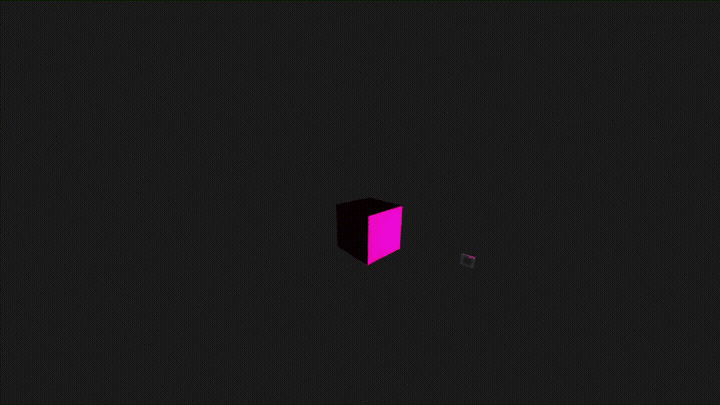

# Floydia 🪲 v1.0
**Floydia** is a C++ OpenGL 4.6 graphics library designed to simplify 2D and 3D development. It provides an easy-to-use, beginner-friendly API while still offering powerful features like resource management, lighting, batch rendering, and more

> ⚠️ Floydia is a **hobby project** and still under active development

Contact me on discord: **vakothebat**

**Teapot with point light source**


**Directional light**


**Spotlight**


**Metallic material**


**Editor Panel**


---

# Features
- **Beginner-Friendly API**: Designed with simplicity in mind, easy to learn for new developers while remaining powerful enough for advanced users
- **2D and 3D development**: Easy-to-use tools for 2D and 3D development:
	+ Basic shapes: `Cube`, `Sprite`, `Billboard`
	+ Wavefront OBJ loading with `.mtl` material support
	+ `PerspectiveCamera` and `OrthoCamera`
- **Lighting System**: Blinn-Phong shading with three light types: Directional, Point and Spot
- **Material System**
	+ Per-object `metallic` and `roughness` properties
	+ Custom GLSL shader support via separable shader pipeline
- **Batch Renderer**: Automatic instanced draw call batching grouped by mesh, shader and texture
- **Frustum Culling**: Automatic per-object visibility testing against the camera frustum
- **AABB**: Per-model and per-submesh axis-aligned bounding boxes
- **Asset Manager**: Automatic caching of meshes, shaders, textures and materials
- **Script System**: Custom and reusable scripts attachable to Objects
- **Editor Panel**: Built-in editor panel

---

# Libraries used
- [`RGFW`](https://github.com/ColleagueRiley/RGFW) for window and input management
- [`miniaudio`](https://miniaud.io/) for sound handling
- [`stb_image`](https://github.com/nothings/stb) for image loading
- [`stb_truetype`](https://github.com/nothings/stb) for TTF font loading
- [`GLAD`](https://github.com/Dav1dde/glad) for OpenGL loader
- [`glm`](https://github.com/g-truc/glm) for vector and matrix math
- [`tinyobjloader`](https://github.com/tinyobjloader/tinyobjloader) for Wavefront OBJ loader

> Licenses for all third-party libraries are avaiable in the [`licenses/`](licenses/) directory

## Dependencies
- `libxcursor`
- `libxrandr`
- `libxi`
- `mesa` (`libgl1-mesa-dev` on Debian)

Only `GLAD` and `glm` headers are required 

---

# Example: Rotating Cube with Script System
This example implements:
- Rotating cube
- Orbitating light
- Camera movement
- Viewport update on Window resize
- Script System to rotate the cube



```cpp
using namespace floyd;

// Y rotation script
struct Rotator : public Script {
	float speed = 50.0f; // Degrees per second

	void update(float dt) noexcept override {
		owner->transform.rotate({ 0.0f, this->speed * dt, 0.0f });
	}
};

// Orbit script
struct Orbiter : public Script {
	Object* target = nullptr; // Orbit target
	float radius = 5.0f; // Orbit radius
	float speed  = 1.0f; // Multiplier
	float angle  = 0.0f;

	Orbiter(Object* target) : target(target) {}

	void update(const float dt) noexcept override {
		this->angle += dt * this->speed;
		owner->transform.set_position(math::orbitate_sphere(
			target->transform.position(),
			this->angle * 60.0f, // Horizontal speed
			this->angle * 30.0f, // Vertical speed
			this->radius
		));
	}
};

void move_camera(const Window& window, PerspectiveCamera& camera);

int main() {
	Window window = Window({
		.width = 800,
		.height = 600,
		.title = "Hello world from Floydia",
		.resizable = true,
	});
	window.set_vsync(false);

	// FOV, Window width, Window height
	PerspectiveCamera camera = PerspectiveCamera(90.0f, 800.0f, 600.0f);
	camera.sensitivity = 0.2f; // Changing camera's sensibility

	// Set up cube
	Cube cube = Cube();
	cube.transform.set_position({ 0.0f, 0.0f, 0.0f });
	cube.set_color({ 202, 23, 115, 255 });
	cube.material()->metallic = 1.0f;
	cube.material()->roughness = 0.0f; // Maximum shine
	cube.attach_script<Rotator>(); // Attach script

	// Set up light source
	Light lamp = Light(Light::Type::Point);
	lamp.transform.set_position({ 0.0f, 3.0f, 10.0f });
	lamp.intensity = 2.0f;
	lamp.range     = 15.0f;
	lamp.attach_script<Orbiter>(&cube); // Attach Orbiter script passing target
	// View the light source
	Cube debug_lamp = Cube();
	debug_lamp.transform.set_scale({ 0.2f, 0.2f, 0.2f });
	// Cube doesn't the need same script

	// Update viewport on window resize
	window.on_event(Event::WINDOW_RESIZED, [&](){
		const vec2<u32> new_size = window.size();
		window.update_viewport(new_size.x, new_size.y);
		camera.update_viewport(new_size.x, new_size.y);
	});

	float rotation = 0.0f;
	float dt = 0.0f;
	while(window.is_open()) {
		window.clear();
		window.poll_events();
		dt = window.dt();

		// If QUIT event or pressed ESCAPE key and mouse isn't grabbed
		if (window.has_event(Event::WINDOW_QUIT) ||
				(!window.is_mouse_grabbed() && window.keypressed(Keycode::ESCAPE))) {
			window.close();
		}

		// Capture mouse
		if(window.mousedown(MouseButton::LEFT)) {
			window.set_grab_mouse(true);
			window.set_hide_mouse(true);
		}
		// Release mouse
		if(window.keypressed(Keycode::ESCAPE)) {
			window.set_grab_mouse(false);
			window.set_hide_mouse(false);
		}

		move_camera(window, camera);

		window.begin_frame();
			// 3D dynamic shapes
			window.begin_draw(camera);
				window.draw(lamp);
				window.draw(cube);
				window.draw(debug_lamp);
			window.flush();
		window.end_frame();

		cube.update_scripts(dt); // Update scripts for this Object
		lamp.update_scripts(dt);
		// Copy lamp position
		debug_lamp.transform.set_position(lamp.transform.position());

		// Update rotation
		rotation += 1.0f * window.dt();
		if (rotation >= 360.0f) {
			rotation = 0.0f;
		}

		window.swap_buffers();
	}
}

void move_camera(const Window& window, PerspectiveCamera& camera) {
	constexpr float speed = 5.0f;
	float velocity = speed * window.dt();

	vec3<float> dir = vec3<float>(0.0f);

	// Forward and backward
	if(window.keydown(Keycode::W)) {
		dir.z = -1;
	} else if(window.keydown(Keycode::S)) {
		dir.z = 1;
	}

	// Left and right
	if(window.keydown(Keycode::A)) {
		dir.x = -1;
	} else if(window.keydown(Keycode::D)) {
		dir.x = 1;
	}

	// Up and down
	if(window.keydown(Keycode::Q)) {
		dir.y = 1;
	} else if(window.keydown(Keycode::E)) {
		dir.y = -1;
	}

	// Speed up
	if(window.keydown(Keycode::LSHIFT)) {
		velocity *= 5.0f;
	}

	// Rotate camera
	camera.move(dir, velocity);
	if(window.is_mouse_grabbed()) {
		camera.rotate(window.mouse_vector());
	}
}
```

---

# Compiling
The library has been tested on **Linux** and **Windows**

## Build Commands
Outputs a static and shared library under `build/`:
```sh
make release
```

With debug flags:
```sh
make debug vars
```

> The "debug" flag removes compile otimization


## Debug Macros
| Macro                       | Description                             |
|-----------------------------|-----------------------------------------|
| `FLOYD_DEBUG_RENDERER`      | Logs batch creation and draw call count |
| `FLOYD_DEBUG_MAPPED_BUFFER` | Logs SSBO/UBO resize events             |
| `FLOYD_DEBUG_TEXT`          | Generates an image of the atlas         |


<!--
## Using the Library
To use the provided [Makefile](examples/Makefile), follow this project structure:
```py
your_project/
├── src/               # Your source files
├── lib/
│   └── floydia/       # Built static/shared library
├── include/
│   ├── floydia/       # Floydia headers
│   └── external/glad/ # GLAD header
│   └── external/glm/  # glm header
```

Then run:
```sh
make
```
-->

---

# Contributing
Floydia is a personal project, but contributions are very welcome!

# LICENSE
This project is licensed under a **modified zlib License**. See the [LICENSE](LICENSE) file for full terms

